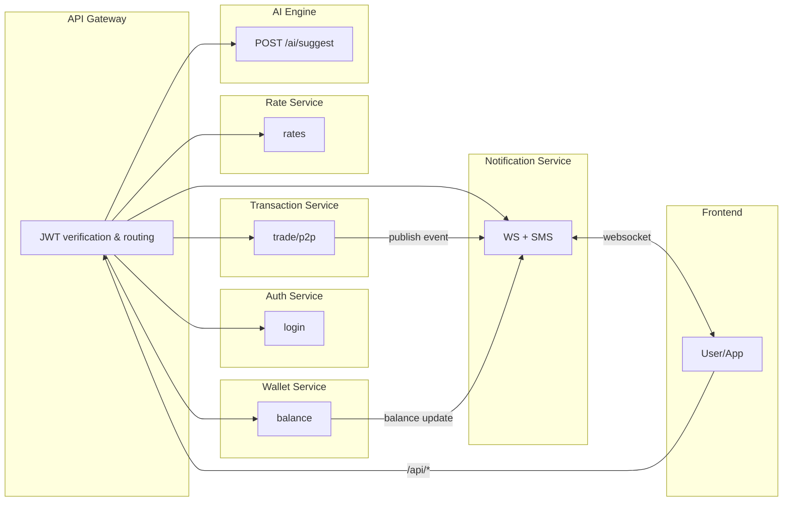
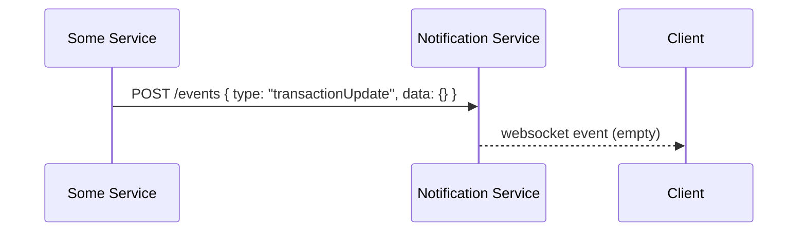
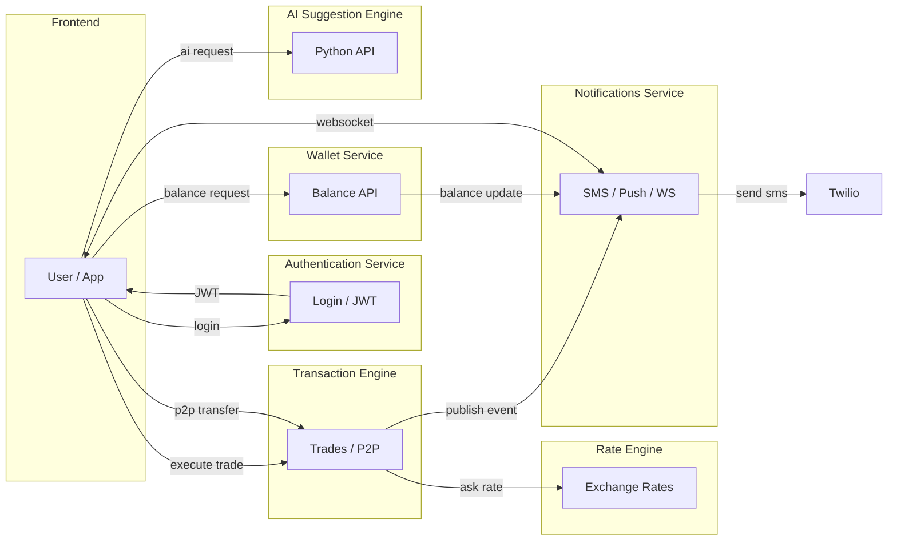
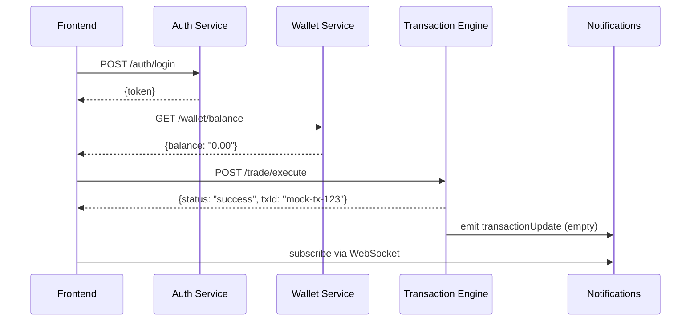
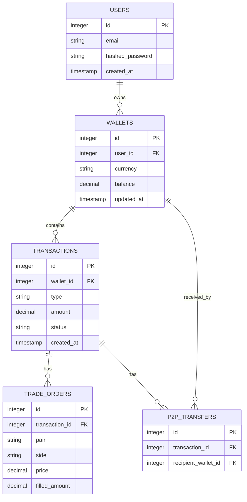
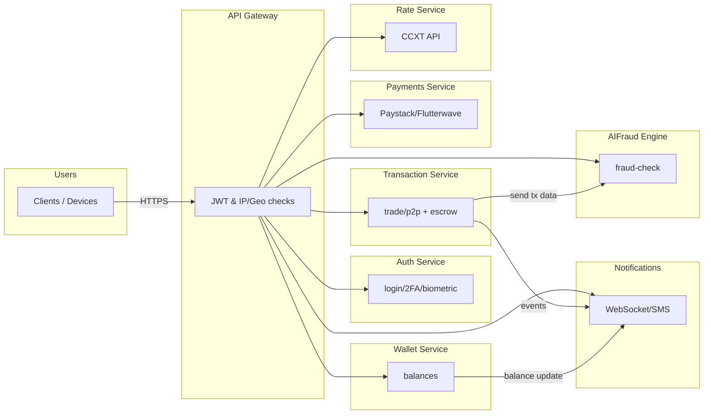

# VentusVault Backend Design (Production Ready)

This document outlines a production‑ready backend architecture for **VentusVault**.  The goal is to support a scalable, maintainable microservices environment with real‑time updates, AI integration and SMS notifications.

---

## 🛠️ Tech Stack

| Component | Recommended Technology |
|-----------|------------------------|
| Microservice runtime | **Node.js** (Express/Koa/Fastify) or **Go** for high‑performance services |
| AI suggestion engine | **Python** (Flask/FastAPI) hosting LLMs or calling OpenAI APIs |
| Real‑time transport | **WebSocket** (Socket.io) or push notifications via FCM/APNs |
| Messaging/Queue | RabbitMQ / Kafka for cross‑service communication (optional)
| SMS provider | Twilio, Vonage (Nexmo), or similar | 
| Authentication | JWT / OAuth2, hosted in auth service |

> **Note:** Node.js is chosen here since the existing repo already uses Express; Go can be adopted progressively for CPU‑bound services such as the transaction engine.

---

## 🧩 Microservices Overview

1. **Authentication Service** – handles login, token issuance, refresh tokens.
2. **Wallet Service** – stores and returns user wallet balances, funding/withdrawals.
3. **Transaction Engine** – executes trades and P2P transfers, interfaces with ledger.
4. **Rate Engine** – provides exchange rates and pricing information.
5. **AI Suggestion Engine** – Python service generating smart recommendations or prompts.
6. **Notifications Service** – sends SMS, email, push; publishes WebSocket events.

Each service exposes a clearly versioned HTTP API.  Services communicate via REST/gRPC or through a message bus, avoiding tight coupling.

---

## 📡 API Endpoints (Front‑end)

The front‑end should call the following endpoints.  All responses are placeholders at the moment – no real user data is populated.

### Authentication
```http
POST /api/auth/login
Body: { email, password }
Response: { token: "<JWT>" }
```

### Wallet
```http
GET /api/wallet/balance
Response: { balance: "0.00", currency: "USD" }
```

### Payments / Payouts
```http
POST /api/payments/naira-payout
Body: { userId, amount, currency: "NGN", provider: "paystack"|"flutterwave" }
Response: { status: "queued" }
```
- integrates with Paystack or Flutterwave for Naira payouts.
- provider secrets stored in env (`PAYSTACK_SECRET`, `FLUTTERWAVE_SECRET`).
- fallback: on failure the request is queued/flagged for retry and 503 returned.

### Trade (rates)
```http
GET /api/rate?pair=BTC/USDT
Response: { rate: 43123.45 }
```
- uses `ccxt` to query exchanges (Binance by default).
- supported symbols: BTC, ETH, USDT, SOL (others easily added).
- if external API fails, returns cached or null rate (fallback).

### Trade execution
```http
POST /api/trade/execute
Body: { pair, amount, side }
Response: { status: "success", txId: "mock-tx-123" }
```

### Peer‑to‑peer (P2P) & Escrow
```http
POST /api/p2p/transfer
Body: { recipientId, amount }
Response: { status: "queued", transferId: "p2p-mock-001" }
```
```http
POST /api/p2p/escrow/release
Body: { escrowId }
Response: { status: "released" }
```
```http
POST /api/p2p/escrow/cancel
Body: { escrowId }
Response: { status: "cancelled" }
```
- escrow ledger ensures funds are held until both parties confirm.
- transaction service records escrow entries (placeholder).
- fallback: if payment or external service fails, the transaction is rolled back and event queued.

### Trade
```http
POST /api/trade/execute
Body: { pair, amount, side }
Response: { status: "success", txId: "mock-tx-123" }
```

### P2P Transfer
```http
POST /api/p2p/transfer
Body: { recipientId, amount }
Response: { status: "queued", transferId: "p2p-mock-001" }
```

### History
```http
GET /api/history
Response: { transactions: [] }
```

### AI Suggestions
```http
POST /api/ai/suggestion
Body: { prompt: "..." }
Response: { suggestion: "..." }
```

### Notifications / SMS
```http
POST /api/notifications/sms
Body: { to: "+15555551234", message: "..." }
Response: { status: "sent" }
```

> All endpoints currently return empty/placeholder values; fields like user names, balances or recent activity are intentionally blank.

---

## 🔄 Real‑Time Updates

- A central WebSocket server (implemented via `socket.io` in the monolith or as a separate notifications service) broadcasts events such as `balanceUpdate`, `transactionUpdate`, `rateChange`, etc.
- Clients subscribe after authentication and receive updates instantly.
- Alternatively, push notifications (FCM/APNs) are triggered by the notifications service for mobile devices.

Example event:
```js
socket.emit('balanceUpdate', { userId, balance: '123.45' });
```

---

## 📱 SMS & AI Assistant Integration

- **SMS**: The notifications service uses environment credentials to call Twilio (or similar).  In production, retries, rate‑limiting and delivery hooks should be handled.
- **AI Assistant**: Exposed via `/api/ai/suggestion`; forwards the request to the Python engine.  The engine may wrap OpenAI/GPT or run an in‑house LLM and respond with text suggestions.

Development note: the current repository includes a `server/services.ts` helper that mocks both SMS sending and AI responses; these will be replaced by network calls in each microservice.

---

## 📊 Service Diagrams

### Refactored Microservices with API Gateway

The codebase now contains a `services/` directory with the following layout:

```
/services
  /api-gateway
  /auth-service
  /wallet-service
  /transaction-service
  /rate-service
  /notification-service
  /ai-engine
```

Each service is self‑contained with its own package.json (or requirements.txt) and runs on a dedicated port.  Configuration is provided via environment variables.


The monolithic server has been split into discrete services under `/services`. An **API Gateway** provides a single public entry point, performing JWT validation and proxying requests to the appropriate backend service.  Each service runs on its own port and exposes only its own endpoints.  Inter‑service communication is REST‑based for now; a message queue (RabbitMQ/Redis) can be added later for event propagation.



### Event Publishing Flow

Services that need to notify clients send their event objects over REST to the notification service; that service may later be backed by a message queue.




### Microservices Communication



### Data Flow (Empty placeholders)



---

## 🛠️ Running the Services

## 🗄️ Database & Storage Design

The backend leverages multiple specialized datastores to meet performance, consistency and analytics requirements:

1. **Core transactional database** – PostgreSQL hosts the ledger and wallet tables with strict ACID guarantees.  All writes (balances, trades, transfers) are performed inside database transactions to ensure atomicity and concurrency safety.

   - **tables**:
     - `users` (id PK, email, hashed_password, created_at)
     - `wallets` (id PK, user_id FK→users, currency, balance DECIMAL, updated_at)
     - `transactions` (id PK, wallet_id FK→wallets, type ENUM('trade','p2p','deposit','withdrawal'), amount DECIMAL, status, created_at)
     - `trade_orders` (id PK, transaction_id FK→transactions, pair, side, price, filled_amount)
     - `p2p_transfers` (id PK, transaction_id FK→transactions, recipient_wallet_id FK→wallets)

   - **relationships**: one-to-many between users→wallets, wallets→transactions, transactions→trade_orders/p2p_transfers.
   - All money-moving operations execute within a `BEGIN/COMMIT` block; row‑level locks (`SELECT ... FOR UPDATE`) prevent race conditions.

2. **Caching layer** – Redis stores ephemeral data such as current wallet balances, rate lookups and sessions. Services subscribe/publish via Redis Pub/Sub for fast notifications.

3. **Event system** – Kafka or RabbitMQ (chosen depending on infrastructure) acts as a durable pub/sub bus for real‑time updates. Each microservice publishes domain events (e.g. `TradeExecuted`, `BalanceChanged`) and the notification service subscribes to relay to clients.

4. **Search & analytics** – Elasticsearch indexes transaction logs and user activity for ad‑hoc queries, fraud detection and reporting. A separate process (e.g. Debezium or custom sync) streams Postgres changes into ES.

### ERD Diagram



### Microservice connections

- **Auth service** reads from `users` for login.
- **Wallet service** updates `wallets` and caches balances in Redis.
- **Transaction service** writes to `transactions`/`trade_orders`/`p2p_transfers` within single DB transactions.
- **Rate service** may use Redis for latest rates; does not use Postgres.
- **Notification service** consumes Kafka/RabbitMQ events; does not access Postgres directly.
- **AI engine** and analytics pipelines query Elasticsearch for historical data.

Atomicity & concurrency safety is guaranteed by Postgres transactions and proper indexing; high‑throughput operations can use `SELECT FOR UPDATE` or advisory locks to prevent double‑spend.


Each service is independent and can be started from its directory. Example (Node.js):

```bash
cd services/auth-service
npm install
npm start            # listens on PORT or default 3001
```

Python AI engine:

```bash
cd services/ai-engine
python -m venv venv
source venv/bin/activate   # or Windows equivalent
pip install -r requirements.txt
uvicorn main:app --port 3005
```

Environment variables such as `PORT`, `JWT_SECRET`, `NOTIF_URL` are read from the process environment; sample `.env.example` files are provided in each folder.

### 🐳 Docker / Compose

A set of `Dockerfile`s lives in each service directory; a root `docker-compose.yml` builds them and orchestrates the network.  Only the API gateway is published to the host.

To run everything locally:

```bash
cd <repo-root>
docker-compose build
# optionally provide a .env file at root with secrets (JWT_SECRET, etc)
docker-compose up
```

Services communicate over the internal `ventus-network` bridge; other containers (auth-service, wallet-service, etc.) are not exposed externally.  Redis is included as the cache/broker.

After compose is up you can hit `http://localhost:4000/api/...` just like the manual mode.


## 🔐 Security & Compliance

To prepare for production-grade security, several layers are envisioned:

1. **Authentication & access control**
   - **JWT-based** tokens issued by auth service (1‑hour expiry, refresh tokens not shown).
   - **Biometric login** endpoint (`/auth/biometric-login`) allows user devices to send fingerprint/face data; token issued on match.
   - **Two‑factor authentication** – endpoints (`/auth/2fa/enable`, `/auth/2fa/verify`) support TOTP/SMS codes.
   - Rate limiting and IP/geolocation middleware in API Gateway block or log suspicious traffic. Blocked countries can be set via `BLOCKED_COUNTRIES` env var.

2. **AI-based fraud detection**
   - AI engine hosts `/ai/fraud-check` which analyses incoming transactions for anomalies.  All transaction services submit copies of activity for scoring; suspicious events can trigger alerts or automatic holds.

3. **Encryption**
   - **In transit**: all external endpoints must be served over **TLS** (HTTPS).  Docker/compose is for development; production deployments should use ingress controllers or API gateways with proper certificates.
   - **At rest**: sensitive data (wallet balances, user credentials, escrow records) are stored in PostgreSQL with **AES-256** encryption enabled (e.g. using pgcrypto or a cloud-managed encrypted disk).
   - Secrets (API keys, JWT secret, DB passwords) are kept in environment variables or a secrets manager.

4. **Rate‑limiting & IP/geolocation**
   - Express‑rate‑limit middleware on every service; above‑gateway middleware checks IP location via `geoip-lite`.
   - Suspicious request rates are logged and events audited.

5. **Audit logging**
   - Every service logs transactional events to a structured audit stream (shown in transaction service via `audit()` helper).  Audit records include action type, user ID, timestamp, and any relevant payload.
   - Logs are centralized via pino; in production they can be shipped to ELK, Splunk or a SIEM.

### 🔄 Updated system diagram (security integration)



The diagram highlights authentication flow, IP filtering at the gateway, and the AI fraud engine consuming transaction data.

## ✅ Next Steps

1. Break the monolith into independent repos/services.
2. Implement each service with its own data store and CI pipeline.
3. Add security (OAuth2, rate‑limiting, input validation).
4. Deploy via Kubernetes/containers; use service mesh for communication.

With this foundation, VentusVault will be prepared for scale, resilience and future feature growth.

---

*Document created February 2026.*
